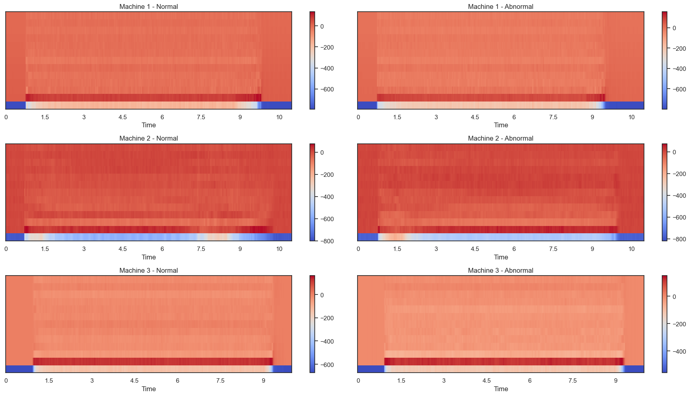
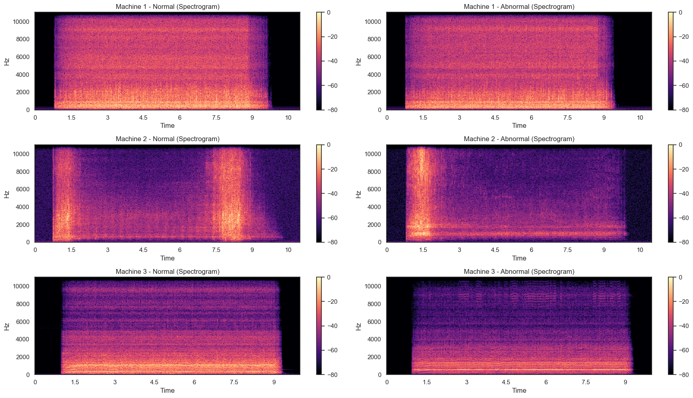
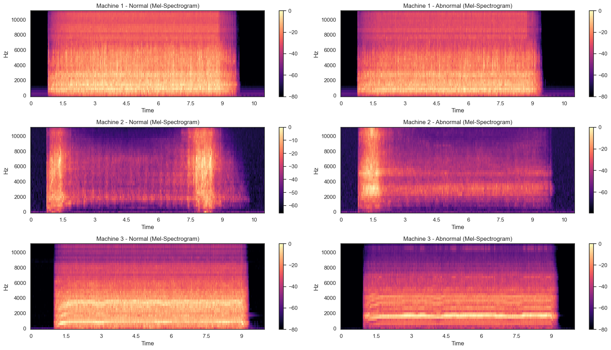

# Machine Fault Detection Using Audio Classification

An end-to-end machine learning and deep learning project for detecting abnormal industrial machine sounds from audio recordings.

The project classifies machine operating conditions by combining audio preprocessing, feature engineering, data augmentation, and multiple classification models.

---

## Dataset

The dataset contains approximately **57 GB** of industrial machine audio recordings from **3 machine types**, each with **Normal** and **Abnormal** operating conditions (6 classes in total).

🔗 https://www.kaggle.com/datasets/mmagdy908/machine-audio-for-pattern-recognition

---

## Inference pipeline

```
Raw Audio
    ↓
Preprocessing
    ↓
Feature Extraction
    ↓
Model
    ↓
Prediction
```

---

## Preprocessing

The audio preprocessing pipeline includes:

- Data deduplication
- Resampling
- Normalization
- Audio cutting

---

## Data Augmentation

To improve generalization and reduce overfitting, the training data is augmented using techniques such as:

- Noise injection
- Time shifting
- Time stretching
- Random cropping

---

## Feature Extraction

Three audio representations were explored:

### MFCC



### Spectrogram



### Mel Spectrogram



---

## Models

### Classical Machine Learning

- Logistic Regression
- Random Forest

### Deep Learning

- Convolutional Neural Network (CNN)

---

## Author

**Ahmed Mohamed**  
📧 [ahmed.mohamed04@hotmail.com](mailto:ahmed.mohamed04@hotmail.com)  
🔗 [LinkedIn Profile](https://www.linkedin.com/in/ahmed04/)
